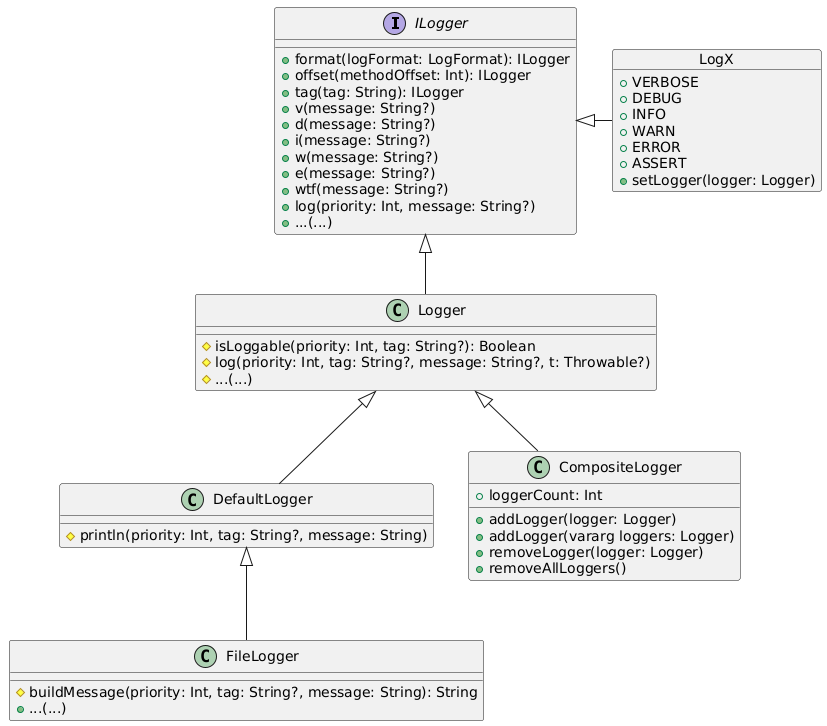
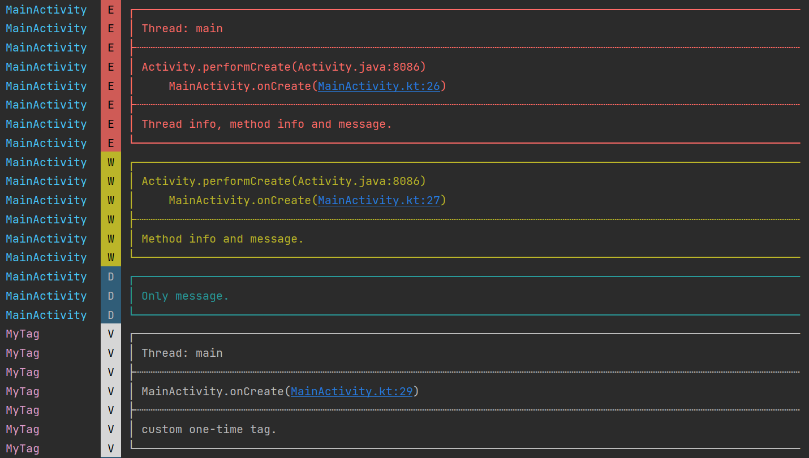

# LogX

[](https://repo1.maven.org/maven2/com/github/jenly1314/logx)
[](https://jitpack.io/#jenly1314/LogX)
[](https://app.circleci.com/pipelines/github/jenly1314/LogX)
[](https://raw.githubusercontent.com/jenly1314/LogX/master/app/release/app-release.apk)
[](https://developer.android.com/guide/topics/manifest/uses-sdk-element#ApiLevels)
[](https://opensource.org/licenses/apache-2-0)

**LogX** —— 轻量而强大的日志框架，兼具 **Timber** 的优雅易用与高度扩展性，同时拥有 **Logger** 般精美的日志格式化输出。

>写这个日志框架的主要原因是为了简化维护流程。在我个人的GitHub开源项目中，有一些需要使用日志功能的库。
>最初，我使用的是一个自维护日志工具类：LogUtils，当开源项目数量较少时，这种方法还比较有效。
>然而，随着开源项目数量的增加，我不得不频繁地复制和维护LogUtils，随着时间的推移，不同开源项目中的LogUtils可能会
>出现一些差异，这大大增加了维护的难度。因此，我开始考虑更加优雅的解决方案。在经过一段时间的思考和研究后，我决定
>结合平时使用的 [Timber](https://github.com/JakeWharton/timber) 和 [Logger](https://github.com/orhanobut/logger) 这
>两个成熟的开源库，取其精华，编写一个新的日志框架，即：**LogX** 。

## 类图



> 从上面的类图可以明确的看出 **LogX** 内部之间的关系与结构。

## 引入

### Gradle:

1. 在Project的 **build.gradle** 或 **setting.gradle** 中添加远程仓库

    ```gradle
    repositories {
        //...
        mavenCentral()
    }
    ```

2. 在Module的 **build.gradle** 中添加依赖项

    ```gradle
    implementation 'com.github.jenly1314:logx:1.2.0'
    ```

## 使用

### 快速使用

如果没有特殊的要求，直接使用即可。

> **LogX** 无需初始化，因为 **LogX** 的默认配置就是个人最推荐的配置。（这也是我写 **LogX** 的原因之一）

主要的一些方法调用示例如下：

```java
LogX.v("verbose");
LogX.d("debug");
LogX.i("info");
LogX.w("warn");
LogX.e("error");
LogX.wtf("assert");

```

占位符格式化示例如下:

```java
LogX.d("hello %s", "world");
```

> 看了上面的基础说明，相信你已经会使用 **LogX** 了；如果还想了解更多，你可以继续往下看更多详细说明。

### 详细说明

#### Logger实现类说明

**LogX** 中内置实现了一些常用的`Logger`，用于满足基本的开发需求；下面简单概括下各`Logger`实现类的特点与适用场景。

**DefaultLogger**

* **特点：** 输出日志到`Logcat`，轻量高效，支持日志分级及超长日志自动拆分。
* **适用场景：** 开发调试、高频日志打印，适合快速排查问题。

**FileLogger**

* **特点：** 持久化日志到文件，支持滚动存储与自动清理旧日志，确保存储空间高效利用。
* **适用场景：** 生产环境问题追踪、离线日志分析。

> `FileLogger` 在持久化日志到文件的同时，也支持同时将日志输出到`Logcat`（需根据配置决定）。

**CompositeLogger**

* **特点：** 组合多个`Logger`，统一分发日志，灵活管理多路输出。
* **适用场景：** 开发与生产环境并行，多维度日志收集，动态调整日志策略。

#### 使用指南

**DefaultLogger & FileLogger**

- 使用方法基本一致
- 区别仅在于配置参数的复杂度（`FileLogger`可配置项更多）
- 具体用法可参考`DefaultLogger`的配置示例

下面就以`DefaultLogger`为例，介绍下配置步骤；

一句话概括：通过构建`DefaultLoggerConfig`完成参数配置，实例化`DefaultLogger`后，设置给`LogX`即可生效。

Java配置示例：

```java

DefaultLoggerConfig config = new DefaultLoggerConfig.Builder()
    .setLogFormat(LogFormat.PRETTY) // 设置日志显示格式（默认：LogFormat.PRETTY）
    .setShowThreadInfo(true) // 设置是否显示线程信息（默认：true）
    .setMethodCount(2) // 设置要显示的调用栈方法行数（默认：2）
    .build();
Logger logger = new DefaultLogger(config);

LogX.setLogger(logger);

```

Kotlin配置示例：

> 虽然`Kotlin`也能用`Builder`来创建实例，但使用`Kotlin DSL`更简洁。

```kotlin
// DSL
val config = DefaultLoggerConfig.build {
    logFormat = LogFormat.PRETTY // 设置日志显示格式（默认：LogFormat.PRETTY）
    showThreadInfo = true // 设置是否显示线程信息（默认：true）
    methodCount = 2 // 设置要显示的调用栈方法行数（默认：2）
}
val logger = DefaultLogger(config)

LogX.setLogger(logger)

```

> `LogFormat`为v1.2.0新增，这里不过多介绍，下面会有`LogFormat`相关说明。

全局配置是否记录日志示例如下：

```java
LogX.setLogger(new DefaultLogger() {
   @Override
   protected boolean isLoggable(int priority, @Nullable String tag) {
//       return super.isLoggable(priority, tag);
        // 例如：只在开发模式才记录日志
       return BuildConfig.DEBUG;
       // 例如：根据priority控制
//       return priority >= LogX.DEBUG;
   }
});
```
> **LogX** 默认配置就是在debug包下才开启日志记录的，release包默认是关闭日志记录的。

**CompositeLogger**

- 采用组合模式统一管理多个`Logger`
- 支持多路日志并行输出

使用`CompositeLogger`管理`Logger`的示例如下：

```java
// CompositeLogger可添加任意的Logger实现
CompositeLogger compositeLogger = new CompositeLogger();
// 例如：添加 DefaultLogger
compositeLogger.addLogger(new DefaultLogger());
// 例如：添加 FileLogger
compositeLogger.addLogger(new FileLogger(context) {
    @Override
    protected boolean isLoggable(int priority, @Nullable String tag) {
        // 例如：警告或警告以上级别日志持久化到日志文件
        return priority >= LogX.WARN;
    }
});

LogX.setLogger(compositeLogger);
```

> 如以上内置的功能都不满足你的需求，你还可以自定义实现一个`Logger`。

### 日志效果

日志的默认输出格式如下：

```
 ┌──────────────────────────────
 │ Thread information
 ├┄┄┄┄┄┄┄┄┄┄┄┄┄┄┄┄┄┄┄┄┄┄┄┄┄┄┄┄┄┄
 │ Method stack history
 ├┄┄┄┄┄┄┄┄┄┄┄┄┄┄┄┄┄┄┄┄┄┄┄┄┄┄┄┄┄┄
 │ Log message
 └──────────────────────────────
```
在Logcat中的实际效果如下：



> 这里的日志效果，对应的日志格式是：`LogFormat.PRETTY`，下面会有`LogFormat`相关说明。

### 特别说明

`LogX`中提供了一些可链式调用的一些小功能，用于满足一些特定需求场景。

#### 关于 **LogX.tag(tag)**

`LogX.tag(tag)`的主要作用：为下次日志调用设置一次性tag。

未指定tag时，默认自动通过调用栈获取简单类名作为tag。如需自定义tag，可使用`LogX.tag(tag)`进行指定。

`LogX.tag(tag)` 使用示例：
```java
// 指定tag
LogX.tag("MyTag").d("debug");
```

#### 关于`LogX.offset(methodOffset)`

`LogX.offset(methodOffset)`的主要作用：为下次日志调用设置一次性方法跟踪偏移量。

**LogX** 支持类似的堆栈偏移调整功能。当迁移现有实现时，使用`LogX.offset(methodOffset)`可保持原有的日志定位准确性，同时获得 **LogX** 增强的格式化输出效果。

示例1：如果之前用的[Timber](https://github.com/JakeWharton/timber)，现通过使用`LogX.offset(methodOffset)` 转到 `LogX`

```java
    Timber.plant(new Timber.Tree() {
        @Override
        protected boolean isLoggable(@Nullable String tag, int priority) {
            return BuildConfig.DEBUG;
        }

        @Override
        protected void log(int priority, @Nullable String tag, @NonNull String message, @Nullable Throwable throwable) {
//            if (tag != null) { // 这里的tag可要可不要
//                LogX.tag(tag);
//            }
            // 在Timber目前层级没发生变化的情况下，方法栈偏移4 即可准确定位到原始Timber调用的代码所在行。（这里不需要throwable，因为message里面已经包含了）
            LogX.offset(4).log(priority, message);
        }
    });

```

示例2：如果之前用的[Logger](https://github.com/orhanobut/logger)，现通过使用`LogX.offset(methodOffset)` 转到 `LogX`

```java
    Logger.addLogAdapter(new LogAdapter() {
        @Override
        public boolean isLoggable(int priority, @Nullable String tag) {
            return BuildConfig.DEBUG;
        }

        @Override
        public void log(int priority, @Nullable String tag, @NonNull String message) {
//            if(tag != null) { // 这里的tag可要可不要
//                LogX.tag(tag);
//            }
            // 在Logger目前层级没发生变化的情况下，方法栈偏移5 即可准确定位到原始Logger调用的代码所在行。
            LogX.offset(5).log(priority, message);
        }
    });

```

> 通过使用`LogX.offset(methodOffset)`进行方法栈的偏移，就算多库混用也互不影响，都能够精确定位到日志对应的代码行。

#### 关于`LogX.format(logFormat)`（v1.2.0新增）

未指定logFormat时，默认使用通过`Logger`构造参数配置项的`logFormat`，如需指定logFormat，可使用`LogX.format(logFormat)`进行指定。

`LogX.format(logFormat)`的主要作用：为下次日志调用设置一次性日志显示格式。

**`LogX.format(logFormat)`的日志格式（即：`LogFormat`）选择：**

##### LogFormat格式说明

- `LogFormat.PRETTY` - 美化格式（默认），带结构化分隔线的日志排版，提升可读性，便于开发调试时快速定位问题；
- `LogFormat.PLAIN` - 普通格式，与Android原生日志格式一致，适用于：高频日志输出，调用栈不重要的场景。

使用`LogX.format(logFormat)`实时切换，平衡可读性与性能。

`LogX.format(logFormat)` 使用示例：

```java
// 指定logFormat
LogX.format(LogFormat.PLAIN).d("original log message");
```

### 关于`FormatUtils`（v1.1.0新增）

格式化`json`和`xml`本不属于日志打印的范畴，但为了提升可读性和美观性，决定提供一个工具类`FormatUtils`来支持此功能。至于是否需要格式化，由开发者根据实际需求自行决定。

#### 格式化json示例：
```java
String json = "{\"key\": \"value\", \"array\":[\"item1\",\"item2\"]}";
// 打印格式化后的json
LogX.d(FormatUtils.formatJson(json));

```

#### 格式化xml示例：
```java
String xml = "<root><key>value</key><array><item>item1</item><item>item2</item></array></root>";
// 打印格式化后的xml
LogX.d(FormatUtils.formatXml(xml));
```

更多使用详情，请查看[app](app)中的源码使用示例或直接查看[API帮助文档](https://jenly1314.github.io/LogX/api/)

## 相关推荐

- [MVVMFrame](https://github.com/jenly1314/MVVMFrame) 一个基于Google官方推出的JetPack构建的MVVM快速开发框架。
- [ZXingLite](https://github.com/jenly1314/ZXingLite) 基于zxing实现的扫码库，优化扫码和生成二维码/条形码功能。
- [MLKit](https://github.com/jenly1314/MLKit) 一个强大易用的工具包。通过ML Kit您可以很轻松的实现文字识别、条码识别、图像标记、人脸检测、对象检测等功能。
- [WeChatQRCode](https://github.com/jenly1314/WeChatQRCode) 基于OpenCV开源的微信二维码引擎移植的扫码识别库。
- [LogX](https://github.com/jenly1314/LogX) 一个简化扫描识别流程的通用基础库。

<!-- end -->

## 版本日志

#### v1.2.0：2025-5-4
* 新增文件日志记录器：`FileLogger`（用于支持持久化日志到文件）
* 新增日志格式：`LogFormat`（用于支持多种的日志显示格式）
* 新增函数：`LogX.format(logFormat)`（用于临时指定日志格式）
* 完善注释说明
* 优化配置方式（让Java与Kotlin的配置方式尽可能的一致）
* 优化一些细节

#### [查看更多版本日志](CHANGELOG.md)

### 社交与联系

| **博客**                                      | **GitHub**                                | **Gitee**                                | **微信公众号**                                               | **Gmail邮箱**                                       | **QQ邮箱**                                            | **QQ群**                                                                        | **QQ群**                                                                        |
|:--------------------------------------------|:------------------------------------------|:-----------------------------------------|:--------------------------------------------------------|:--------------------------------------------------|:----------------------------------------------------|:-------------------------------------------------------------------------------|:-------------------------------------------------------------------------------|
| [Jenly's Blog](https://jenly1314.github.io) | [jenly1314](https://github.com/jenly1314) | [jenly1314](https://gitee.com/jenly1314) | [Jenly666](http://weixin.qq.com/r/wzpWTuPEQL4-ract92-R) | [jenly1314@gmail.com](mailto:jenly1314@gmail.com) | [jenly1314@vip.qq.com](mailto:jenly1314@vip.qq.com) | [20867961](https://qm.qq.com/cgi-bin/qm/qr?k=6_RukjAhwjAdDHEk2G7nph-o8fBFFzZz) | [64020761](https://qm.qq.com/cgi-bin/qm/qr?k=Z9pobM8bzAW7tM_8xC31W8IcbIl0A-zT) |


